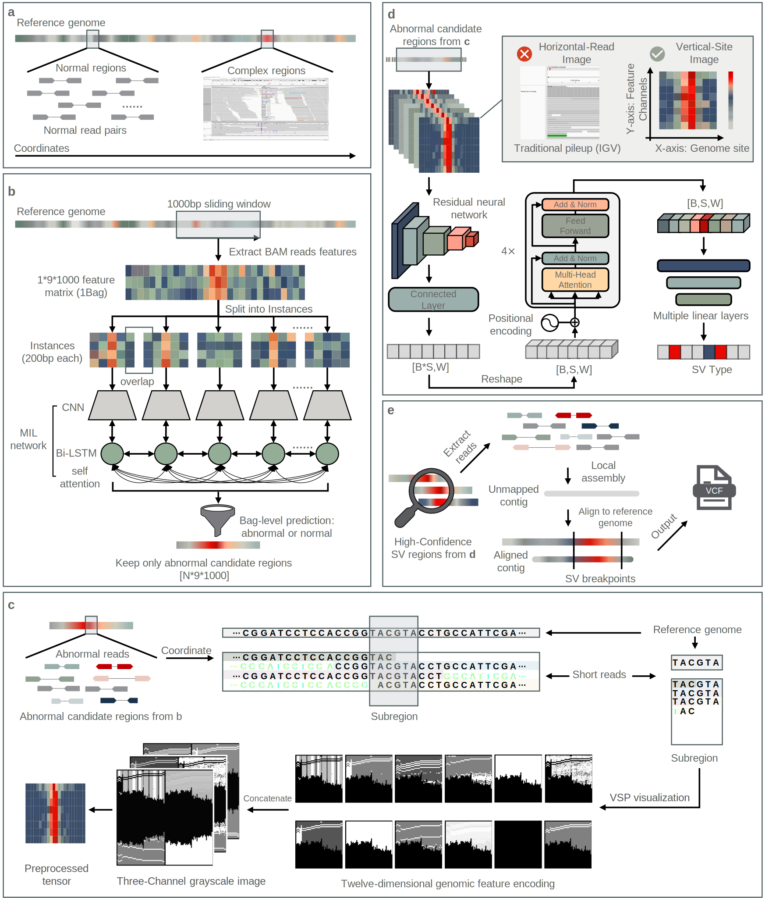

# SharpSV Pipeline Overview

SharpSV is an end-to-end short-read structural variant discovery pipeline. The implementation is organized around four core stages: coarse screening, sequence-to-image encoding, spatial-sequential recognition, and breakpoint refinement, with an additional production-facing VCF finalization step for end-user output.

  

  <em>Fig. 1. Overview of SharpSV for structural variant discovery from short-read sequencing data.</em>

## Pipeline Stages

### 1. Coarse screening

SharpSV scans whole-genome alignments in 1,000-bp windows and extracts nine site-wise alignment features. Each window is partitioned into overlapping 200-bp instances and processed by an attentive multi-instance learning framework to suppress the dominant normal genomic background and nominate high-probability candidate regions.

### 2. Sequence-to-image encoding

Each nominated 1,000-bp candidate window is divided into twenty consecutive 50-bp subregions. SharpSV then converts each subregion into a Vertical-Site Profile (VSP) image, where read-alignment evidence is projected onto precise genomic coordinates in a site-centric manner. Twelve grayscale feature layers are tiled into a three-channel tensor for downstream recognition.

### 3. Spatial-sequential recognition

The ordered VSP image sequence is analyzed by the Spatial-Sequential Recognition Network (SSR-Net), which combines convolutional feature extraction with transformer-based contextual modeling. This stage integrates local visual evidence across adjacent segments to identify variant type and coarse breakpoint span.

### 4. Breakpoint refinement

High-confidence candidate regions are assembled locally, and assembled contigs are realigned to the reference genome. SharpSV applies an adaptive, size-aware validation strategy to confirm events and refine breakpoints to base-pair resolution.

## Mapping To The Codebase

- coarse screening: `sharpsv/stage1/`
- sequence-to-image plus spatial-sequential recognition: `sharpsv/stage2/`
- local assembly and breakpoint refinement: `sharpsv/stage3/`
- production VCF export and DEL realignment extension: `sharpsv/stage4/`
